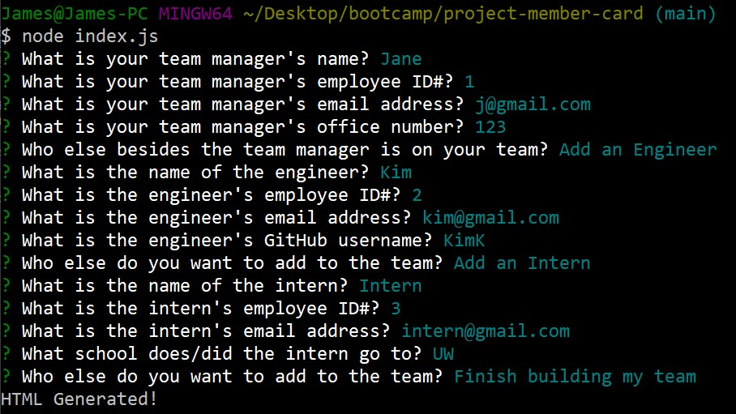
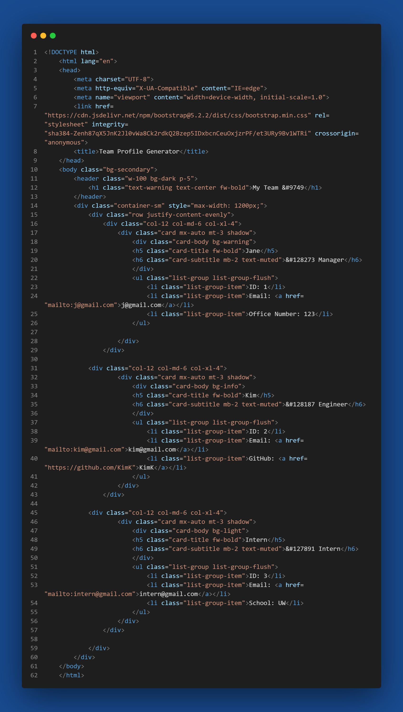
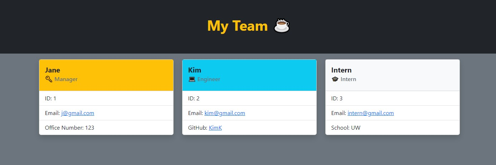

# Project Team Member Card Generator
  [](https://opensource.org/licenses/MIT)
  
  

## Description
Here we have a javascript program using node.js and object oriented programming that will generate a webpage that will display in one easy to read place your project team member's information that you input into the terminal.

We used node.js and object oriented programming to build the program.

The only difficulty posed during the project was the building the tests to catch different kinds of anomalies that could happen during the user's input. In the future, I would like to implement some animations to the cards, or even make the webpage more dynamic and interactive so editing could be done once the webpage is created. More customization on the colors or fonts could be interesting.

## Table of Contents
- [Example](#example)
- [Installation](#installation)
- [Usage](#usage)
- [License](#license)
- [Contributing](#contributing)
- [Tests](#tests)
- [Questions](#questions)

## Example

[Demonstration](https://drive.google.com/file/d/1ZKcuSp-kHrstdM6GDkke82mZ0UqHEJK2/view)

Example of the input, HTML and webpage that is generated:


[](./src/images/sample-html.png)


## Installation

:warning: First, you will need to have installed the latest stable version of **node.js**.

Then, you will need to download this repository and go through the **npm initialization** (include "y" in order to skip through the prompts).

(do this if the **package.json** & **package.-lock.json** is not in the repository.)

```
npm init y
```

Then install the necessary **inquirer v8.2.4 package**.

```
npm install inquirer@8.2.4
```

Once the inquirer is installed and you see that the **package-lock.json** is in the folder, you can run the program by changing directory (cd) in the terminal to this program and run **node index.js**.

```
node index.js
```

Then answer all the prompts to generate a webpage that will have all your team members information in one easy to read place.

## Usage
The program can be run in the terminal making it easy to access from your local device. With the user input, the program will generate a fleshed out webpage with the user's team member's information that are inputted.

This will generate a card for each team member depending on the role selected. For a manager, the name, employee ID#, email and the office number is displayed. For an Engineer, the name, employee ID#, email and their GitHub username (with the link) will be displayed. For an Intern, the name, employee ID#, email and the school they went or are currently going to will display. Each email address will be clickable to open up the default email program with the "Mail To" filled with the email address selected.

Errors will be shown wherever the incorrect input type is received.

## License
Licensed under the [MIT](https://opensource.org/licenses/MIT) license.

## Contributing
Contribution inquiries can be sent through the Github or the email in the question section (although, I work full time with family obligations so replies may be slow). I am open to all suggestions.

## Tests
Four test.js were created in order to test each constructor's methods that are nestled in the code. Parameters were set for different kinds of inputs the user could possibly submit.

## Credits
- [MDN Wed Docs](https://developer.mozilla.org/en-US/)
- [Stack Overflow](https://stackoverflow.com/)
- [Shields.io](https://shields.io/)
- [Github Gist: rxaviers](https://gist.github.com/rxaviers/7360908)

## Questions
Please contact me below for further questions:

:octocat: Github username: [LonelyMitoc](https://github.com/LonelyMitoc)

:e-mail: Email: jamesmatsu@gmail.com